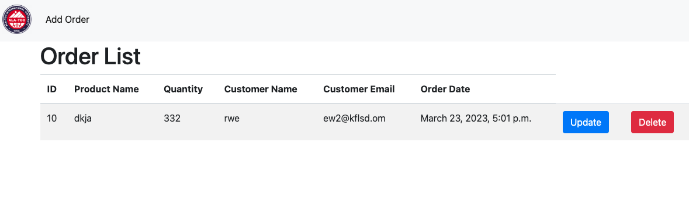
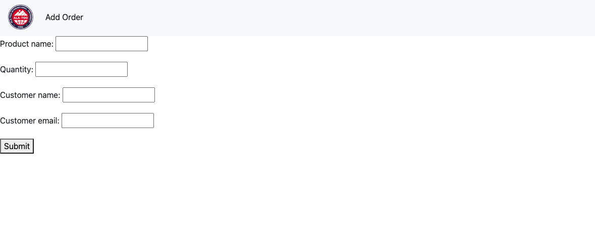
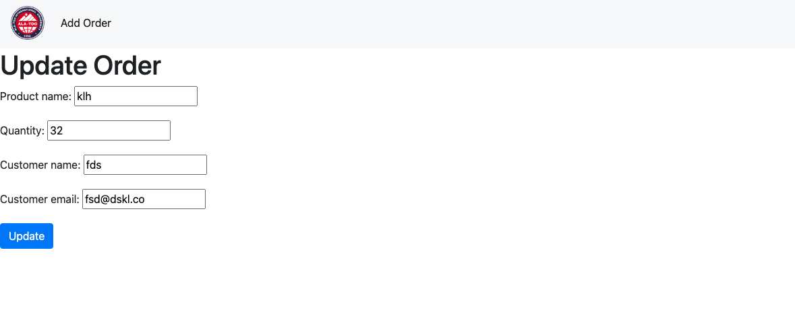
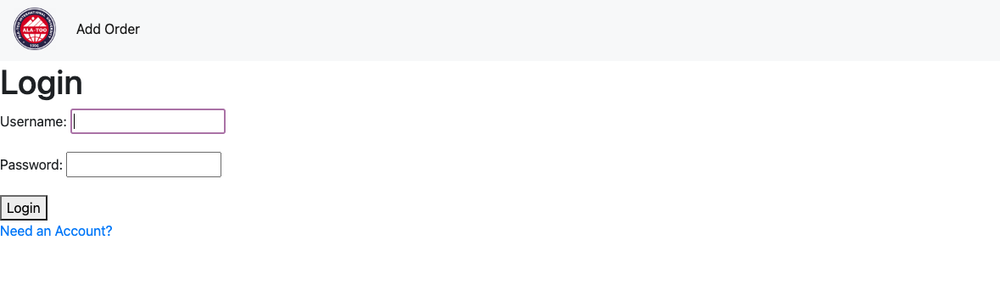
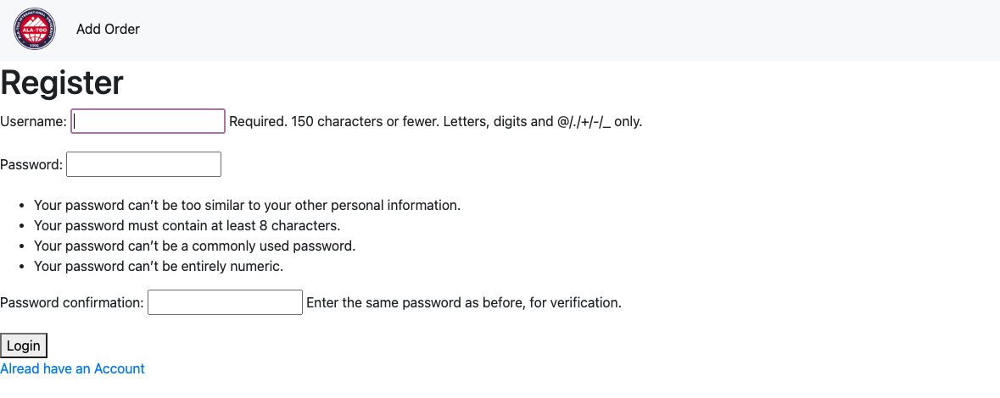

# Backend Midterm Project - Orders RESTAPI CRUD 

## Prerequisites
* Python3 installed
* Run postgres Instance on port `5432`

## ScreenShots






## Setup
1. Clone the repository:
```bash
git clone https://github.com/abdulra7ma/backend-midterm.git
```
2. create virtual environment 
``` bash
python3 -m venv venv
```

3. activate environment
```bash
source venv/bin/activate
```
4. Install the required packages:
``` bash
pip install -r requirements.txt
```
5. Run the migrations
``` bash
python manage.py migrate
```
6. create a superuser
```bash
python manage.py createsuperuser
```
7. start the server
```
python manage.py runserver
```

## Usage
To access the application, open your web browser and navigate to http://localhost:8000/.

### Endpoints
* /login/ - The login page.
* /register/ - The registration page.
* /orders/ - The list of all orders in the database.
* /orders/create/ - The page to create a new order.
* /orders/`<pk>`/update/ - The page to update an existing order.
* /orders/`<pk>`/delete/ - The page to delete an existing order

## Database
* Default database for this project is `Postgres`, but if it's not setup locally then we gonna user `sqlite` instead
* in order to use postgres for this project you should have a running instance of postgres locally, and then you should update the `.env` file with your configration
```file
POSTGRES_DB=
POSTGRES_PASSWORD=
POSTGRES_USER=
POSTGRES_PORT=
POSTGRES_HOST=
```